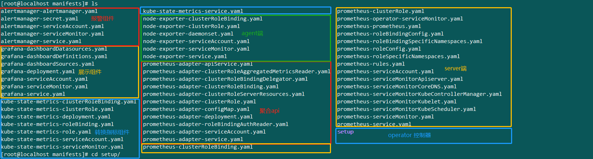
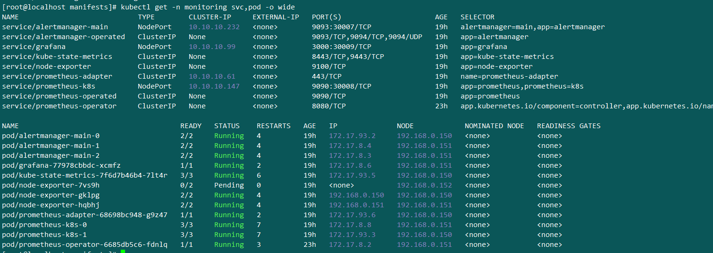

## prometheus 安装配置
#### 相关网站
- 1. https://prometheus.io/   官网
- 2. https://github.com/coreos/kube-prometheus  第三方提供安装
- 3. https://github.com/kubernetes/kubernetes/tree/release-1.15/cluster/addons/prometheus k8s提供的集群安装

#### 相关组件
- <font color=#c4c4c4>`heapster`,`metrics-server` 都是提供node和Pod的CPU和内存使用情况的.metrics-server替代了早期的heapster,装了prometheus全套后，也不需要metrics-server了</font>
- <font color=#FF0000>alertmanager</font>就是负责处理prometheus交给它的报警规则的。由它决定要不要报警，发送给谁。
- <font color=#FF0000>grafana</font> 图形展示工具。跟监控并没有什么必然联系，只是用它做的图形比较漂亮。
- <font color=#FF0000>kube-state-metrics</font>  将指标数据转换为标准的Kubernetes指标,转换完后并不能被k8s获取,需要prometheus-adapter进行整合进自定义api.
- <font color=#FF0000>prometheus-adapter</font> 将kube-state-metrics转换的指标数据整合到聚合api里.提供了一个聚合apiserver【custom-metrics-api】，可以通过kubectl api-versions里查到` custom.metrics.k8s.io `意味着可以通过kubectl获取对应数据.
- <font color=#FF0000>node-exporter</font> 相当于prometheus的agent端,采集node里的信息并转成prometheus能读懂的格式，并提供一个接口，供prometheus从它这里pull数据
- <font color=#FF0000>prometheus</font> prometheus的服务端
- <font color=#FF0000>prometheus-operator</font> 是一个框架,因为是prometheus主动去拉取的,所以在k8s里pod因为调度的原因导致pod的ip会发生变化,人工不可能去维持,自动发现有基于DNS的,但是新增还是有点麻烦.作为一个控制器，他会去创建Prometheus、ServiceMonitor、AlertManager以及PrometheusRule4个CRD自定义资源对象，然后会一直监控并维持这4个资源对象的状态。
   1. 首先就是pod在k8s中先通过service资源对象来将pod中的容器的IP添加到Endpoints资源对象中列表中，用于后期的查找使用。
   2. 其次就是ServiceMonitor资源对象通过标签选择器(serviceMonitorSelector: {})来选择service资源对象。
   3. 然后就是Prometheus server实例通过标签选择器(serviceMonitorSelector: {})来确定应该覆盖哪些ServiceMonitors。
   4. 最后就是operatoroperator创建的statefulsets资源对象依据Prometheus server选择的
   servicemonitor来生成Prometheus的配置文件然后再通过secret文件挂载进去


#### 安装配置

- 下载第三方yaml

   ```bash
   git clone https://github.com/coreos/kube-prometheus
   cd kube-prometheus/manifests
   ls
   ```
- 文件说明
   1. 列出文件,对应上面7个组件


- 开始安装

```bash
# 先进入setup目录,安装控制器和自定义资源
cd kube-prometheus/manifests/setup
kubectl apply -f .
# 没报错则进入上级目录安装各个组件
cd .. 
kubectl apply -f .
# 可修改service对报警端,服务端和展示端暴躁NodePort端口
```
- 检查
   1. 显示如下则表示成功了
   
   2. 可分别访问各个组件看是否能正常显示
      1. http://192.168.0.150:30007    # alertmanager 报警
      2. http://192.168.0.150:30008    # prometheus-ui
      3. http://192.168.0.150:30009    # grafana展示