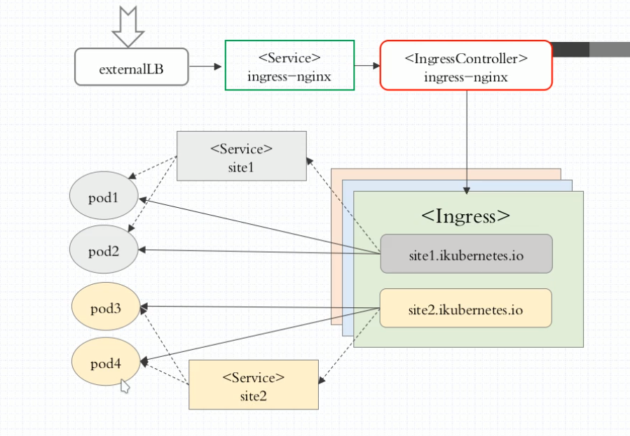
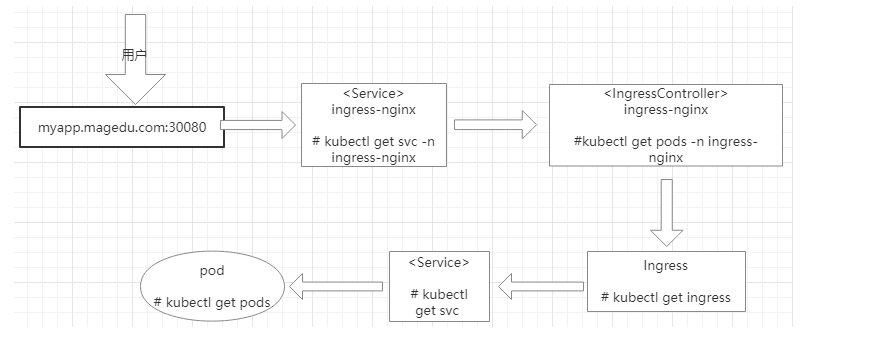

## 1. 图形原理




## 2. 配置

1. 下载`ingress-nginx`的yaml文件,需梯子

```shell
wget https://raw.githubusercontent.com/kubernetes/ingress-nginx/master/deploy/static/mandatory.yaml
```

2. 修改kind模式

将`kind: Deployment`改为`kind: DaemonSet`，注释掉replicas副本参数,注释掉securityContext相关参数,修改镜像下载地址为阿里云仓库,完整yaml文件如下:

```yaml
apiVersion: v1
kind: Namespace
metadata:
  name: ingress-nginx
  labels:
    app.kubernetes.io/name: ingress-nginx
    app.kubernetes.io/part-of: ingress-nginx

---

kind: ConfigMap
apiVersion: v1
metadata:
  name: nginx-configuration
  namespace: ingress-nginx
  labels:
    app.kubernetes.io/name: ingress-nginx
    app.kubernetes.io/part-of: ingress-nginx

---
kind: ConfigMap
apiVersion: v1
metadata:
  name: tcp-services
  namespace: ingress-nginx
  labels:
    app.kubernetes.io/name: ingress-nginx
    app.kubernetes.io/part-of: ingress-nginx

---
kind: ConfigMap
apiVersion: v1
metadata:
  name: udp-services
  namespace: ingress-nginx
  labels:
    app.kubernetes.io/name: ingress-nginx
    app.kubernetes.io/part-of: ingress-nginx

---
apiVersion: v1
kind: ServiceAccount
metadata:
  name: nginx-ingress-serviceaccount
  namespace: ingress-nginx
  labels:
    app.kubernetes.io/name: ingress-nginx
    app.kubernetes.io/part-of: ingress-nginx

---
apiVersion: rbac.authorization.k8s.io/v1beta1
kind: ClusterRole
metadata:
  name: nginx-ingress-clusterrole
  labels:
    app.kubernetes.io/name: ingress-nginx
    app.kubernetes.io/part-of: ingress-nginx
rules:
  - apiGroups:
      - ""
    resources:
      - configmaps
      - endpoints
      - nodes
      - pods
      - secrets
    verbs:
      - list
      - watch
  - apiGroups:
      - ""
    resources:
      - nodes
    verbs:
      - get
  - apiGroups:
      - ""
    resources:
      - services
    verbs:
      - get
      - list
      - watch
  - apiGroups:
      - ""
    resources:
      - events
    verbs:
      - create
      - patch
  - apiGroups:
      - "extensions"
      - "networking.k8s.io"
    resources:
      - ingresses
    verbs:
      - get
      - list
      - watch
  - apiGroups:
      - "extensions"
      - "networking.k8s.io"
    resources:
      - ingresses/status
    verbs:
      - update

---
apiVersion: rbac.authorization.k8s.io/v1beta1
kind: Role
metadata:
  name: nginx-ingress-role
  namespace: ingress-nginx
  labels:
    app.kubernetes.io/name: ingress-nginx
    app.kubernetes.io/part-of: ingress-nginx
rules:
  - apiGroups:
      - ""
    resources:
      - configmaps
      - pods
      - secrets
      - namespaces
    verbs:
      - get
  - apiGroups:
      - ""
    resources:
      - configmaps
    resourceNames:
      # Defaults to "<election-id>-<ingress-class>"
      # Here: "<ingress-controller-leader>-<nginx>"
      # This has to be adapted if you change either parameter
      # when launching the nginx-ingress-controller.
      - "ingress-controller-leader-nginx"
    verbs:
      - get
      - update
  - apiGroups:
      - ""
    resources:
      - configmaps
    verbs:
      - create
  - apiGroups:
      - ""
    resources:
      - endpoints
    verbs:
      - get

---
apiVersion: rbac.authorization.k8s.io/v1beta1
kind: RoleBinding
metadata:
  name: nginx-ingress-role-nisa-binding
  namespace: ingress-nginx
  labels:
    app.kubernetes.io/name: ingress-nginx
    app.kubernetes.io/part-of: ingress-nginx
roleRef:
  apiGroup: rbac.authorization.k8s.io
  kind: Role
  name: nginx-ingress-role
subjects:
  - kind: ServiceAccount
    name: nginx-ingress-serviceaccount
    namespace: ingress-nginx

---
apiVersion: rbac.authorization.k8s.io/v1beta1
kind: ClusterRoleBinding
metadata:
  name: nginx-ingress-clusterrole-nisa-binding
  labels:
    app.kubernetes.io/name: ingress-nginx
    app.kubernetes.io/part-of: ingress-nginx
roleRef:
  apiGroup: rbac.authorization.k8s.io
  kind: ClusterRole
  name: nginx-ingress-clusterrole
subjects:
  - kind: ServiceAccount
    name: nginx-ingress-serviceaccount
    namespace: ingress-nginx

---

apiVersion: apps/v1
kind: DaemonSet
metadata:
  name: nginx-ingress-controller
  namespace: ingress-nginx
  labels:
    app.kubernetes.io/name: ingress-nginx
    app.kubernetes.io/part-of: ingress-nginx
spec:
 # replicas: 1
  selector:
    matchLabels:
      app.kubernetes.io/name: ingress-nginx
      app.kubernetes.io/part-of: ingress-nginx
  template:
    metadata:
      labels:
        app.kubernetes.io/name: ingress-nginx
        app.kubernetes.io/part-of: ingress-nginx
      annotations:
        prometheus.io/port: "10254"
        prometheus.io/scrape: "true"
    spec:
      # wait up to five minutes for the drain of connections
      terminationGracePeriodSeconds: 300
      serviceAccountName: nginx-ingress-serviceaccount
      hostNetwork: true
      nodeSelector:
        kubernetes.io/os: linux
      containers:
        - name: nginx-ingress-controller
          image: registry.cn-hangzhou.aliyuncs.com/k8s_xzb/nginx-ingress-controller:0.26.1
          args:
            - /nginx-ingress-controller
            - --configmap=$(POD_NAMESPACE)/nginx-configuration
            - --tcp-services-configmap=$(POD_NAMESPACE)/tcp-services
            - --udp-services-configmap=$(POD_NAMESPACE)/udp-services
            - --publish-service=$(POD_NAMESPACE)/ingress-nginx
            - --annotations-prefix=nginx.ingress.kubernetes.io
          #securityContext:
          #  allowPrivilegeEscalation: true
          #  capabilities:
          #    drop:
          #      - ALL
          #    add:
          #      - NET_BIND_SERVICE
            # www-data -> 33
          #  runAsUser: 33
          env:
            - name: POD_NAME
              valueFrom:
                fieldRef:
                  fieldPath: metadata.name
            - name: POD_NAMESPACE
              valueFrom:
                fieldRef:
                  fieldPath: metadata.namespace
          ports:
            - name: http
              containerPort: 80
            - name: https
              containerPort: 443
          livenessProbe:
            failureThreshold: 3
            httpGet:
              path: /healthz
              port: 10254
              scheme: HTTP
            initialDelaySeconds: 10
            periodSeconds: 10
            successThreshold: 1
            timeoutSeconds: 10
          readinessProbe:
            failureThreshold: 3
            httpGet:
              path: /healthz
              port: 10254
              scheme: HTTP
            periodSeconds: 10
            successThreshold: 1
            timeoutSeconds: 10
          lifecycle:
            preStop:
              exec:
                command:
                  - /wait-shutdown

---
```
3. 启动后端

```

```

4. 与后端关联
> 关联前请先启动此后端
```yaml
apiVersion: extensions/v1beta1
kind: Ingress
metadata:
  name: jenkins
  namespace: kube-ops
  annotations:
    nginx.ingress.kubernetes.io/ingress.class: "nginx"
spec:
  rules:
  - host: jenkins.xiazaibei.com   # 绑定域名
    http:
      paths:
      - path: /   # 后端匹配地址
        backend:
          serviceName: jenkins2   #后端服务名称
          servicePort: 8080   #后端服务集群端口
```


5. 添加ssl证书

```shell
cd ~
mkdir .acme.sh
curl  https://get.acme.sh | sh
# 阿里云申请一个子帐号给与DNS权限
export Ali_Key=****************************
export Ali_Secret=****************************
# 申请泛域名证书
./acme.sh --issue -d xiazaibei.com -d '*.xiazaibei.com' --dns dns_ali
# 复制泛域名证书到ingress目录
./acme.sh --installcert -d xiazaibei.com --key-file /opt/yaml/ingress/ssl/xiazaibei.com.key --fullchain-file /opt/yaml/ingress/ssl/xiazaibei.com.cer
#创建secret,注意命名空间要一致
kubectl create secret tls -n kube-ops jenkins-tls --cert=xiazaibei.com.cer --key=xiazaibei.com.key
# 开启自动升级acme,证书自动更新脚本已自行添加上去
./acme.sh  --upgrade  --auto-upgrade
```

2. 应用证书

```yaml
apiVersion: extensions/v1beta1
kind: Ingress
metadata:
  name: jenkins
  namespace: kube-ops
  annotations:
    nginx.ingress.kubernetes.io/ingress.class: "nginx"
spec:
  rules:
  - host: jenkins.xiazaibei.com   # 绑定域名
    http:
      paths:
      - path: /   # 后端匹配地址
        backend:
          serviceName: jenkins2   #后端服务名称
          servicePort: 8080   #后端服务集群端口
  tls:
  - hosts:
    - "*.xiazaibei.com"   #与secret证书的域名需要保持一致
    secretName: jenkins-tls   #secret证书的名称
```
> 如未生效,请重启一下ingress pod