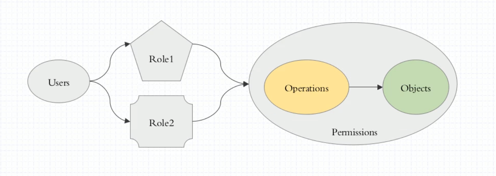
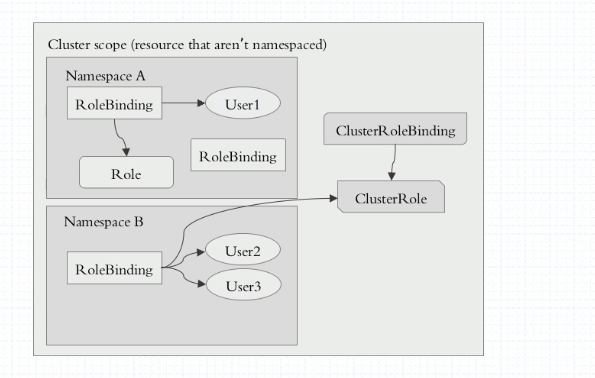

#### 授权插件RBAC


> RBAC: Role-based AC     基于角色的用户控制




##### 1. 定义角色权限  
> 作用: 定义角色访问权限 
   - Role  只能用于授予对某一namespace中资源的权限
   - ClusterRole 可以授予整个集群范围内资源访问权限， 也可以对以下几种资源的授予访问权限
      1. 集群范围资源（例如节点，即node）
      2. 非资源类型endpoint（例如”/healthz”）
      3. 跨所有namespaces的范围资源（例如pod,命令kubectl get pods -A 来查询集群中所有的pod)

1.1  定义角色权限 role
```yaml
# role 资源定义
# kubectl create role test-pods-reader --verb=get,list,watch --resource=pods --dry-run -o yaml
apiVersion: rbac.authorization.k8s.io/v1
kind: Role
metadata:
  name: test-pods-reader
  namespace: default    # 对哪个命名空间操作
rules:
- apiGroups:        # 对哪些api群组内的资源操作
  - ""
  resources:    # 对哪些资源操作
  - pods
  verbs:        # 定义权限
  - get
  - list
  - watch
```
1.2  定义角色权限 clusterrole
```yaml
# clusterrole 资源定义
# kubectl create clusterrole cluster-pods-reader --verb=get,list,watch --resource=pods --dry-run -oyaml
apiVersion: rbac.authorization.k8s.io/v1
kind: ClusterRole
metadata:
  name: cluster-pods-reader
  # 鉴于ClusterRole是集群范围对象，所以这里不需要定义"namespace"字段
rules:
- apiGroups:    # 对哪些api群组内的资源操作
  - ""
  resources:     # 对哪些资源操作
  - pods
  verbs:    # 定义权限
  - get
  - list
  - watch
```

##### 2. 角色权限绑定
> 把某个用户或某一组用户和role权限绑定在一起,则该用户或用户组则具有对应绑定的Role或ClusterRole定义的权限
   - RoleBinding 将同一namespace中的subject（用户）绑定到某个具有特定权限的Role下，则此subject即具有该Role定义的权限。
   - ClusterRoleBinding 在整个集群和所有namespaces将特定的用户或用户组与ClusterRole绑定，授予权限




2.1 角色权限绑定 rolebinding 

```yaml 
# rolebinding 角色权限绑定
# kubectl create clusterrole cluster-pods-reader --verb=get,list,watch --resource=pods --dry-run -o yaml
apiVersion: rbac.authorization.k8s.io/v1
kind: RoleBinding
metadata:
  name: bind-pods-reader
  namespace: default    # 对哪个命名空间操作,若不定义该字段，则表示整个集群的Pod资源都可访问
roleRef:    # 绑定哪些role
  apiGroup: rbac.authorization.k8s.io
  kind: Role    
  name: test-pods-reader    # 要绑定的role名字
subjects:   # 用户列表
- apiGroup: rbac.authorization.k8s.io
  kind: User    # 绑定用户类型 user OR group OR ServiceAccount
  name: fengzi     # 用户名
```
2.2 角色权限绑定 ClusterRoleBinding 

```yaml 
# clusterrolebinding 角色权限绑定
# kubectl create clusterrolebinding fengzi-all-pods --clusterrole=cluster-pods-reader --user=fengzi --dry-run -o yaml
apiVersion: rbac.authorization.k8s.io/v1beta1
kind: ClusterRoleBinding
metadata:
  name: fengzi-all-pods
  # 鉴于ClusterRole是集群范围对象，所以这里不需要定义"namespace"字段
roleRef:    # 绑定哪些clusterrole
  apiGroup: rbac.authorization.k8s.io
  kind: ClusterRole
  name: cluster-pods-reader   # 要绑定的clusterrole的名字
subjects:   # 用户列表
- apiGroup: rbac.authorization.k8s.io
  kind: User    # 绑定用户类型 user OR group OR ServiceAccount
  name: fengzi    # 用户名
```

```bash
kubectl get clusterrole
admin   # 对某一个命名空间具有所有权限
cluster-admin   # 对某一个集群具有所有权限
```
