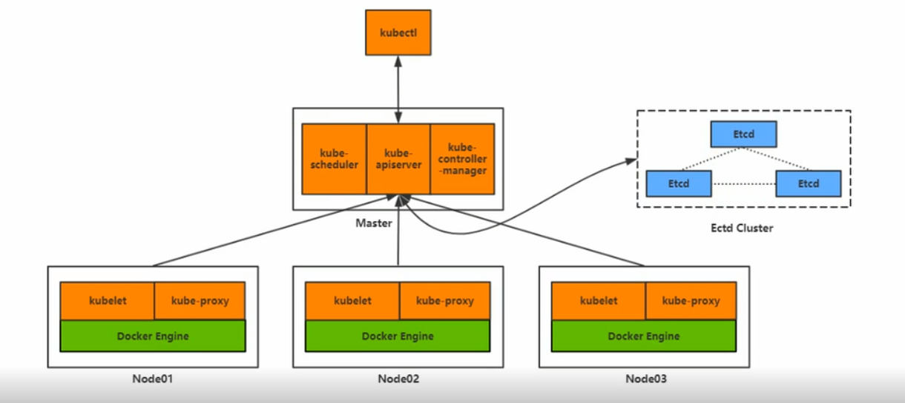
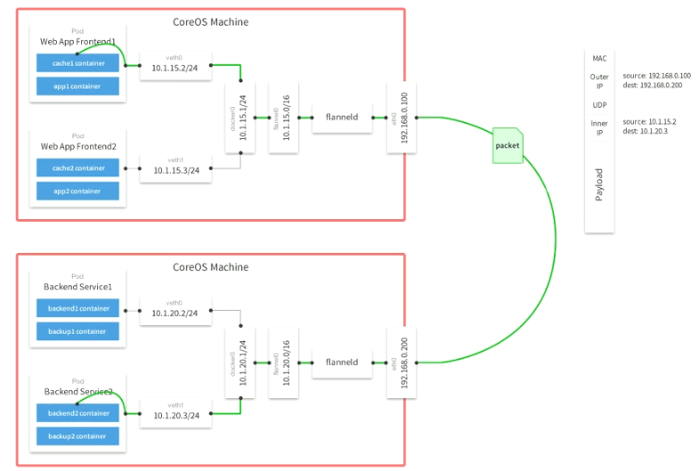

[toc]
# k8s集群使用
## 1. 环境说明
软件|版本|备注
---|---|---|---
centos|7.6.1804
kubernetes| 1.15
Docker| 18.09.6
Etcd| 3.3.13
flannel | 0.11
-----
角色|IP|组件|推荐配置|备注
---|---|---|---|---
master|192.168.0.130|kube-apiserver、kube-controller-manager、kube-scheduler、etcd|4核4G
node1|192.168.0.150|kubelet、kube-proxy、docker、flannel、etcd|4核4G
node2|192.168.0.151|kubelet、kube-proxy、docker、flannel、etcd|4核4G
------------------------------

## 2. 准备工作
1. 三台服务器上最小化安装centos 7.6
2. 在`master`上装个`ansible`，方便一会统一配置两台`node`
```bash
yum install ansible -y
```
2. 在`master`生成秘钥对，并将公钥拷到`node`节点，配置免密登录，方便操作。
```bash
ssh-keygen
# 全部回车，创建无密码的秘钥对
ssh-copy-id root@192.168.0.150
ssh-copy-id root@192.168.0.151
```
3. `ansible`设置`k8snodes`分组
```bash
mv /etc/ansible/hosts /etc/ansible/hosts.default
cat >> /etc/ansible/hosts <<EOF
[k8snodes]
192.168.0.150
192.168.0.151
EOF
```
测试一下
```bash
ansible k8snodes -m shell -a "hostname -I" 
ansible 192.168.0.150 -m shell -a "hostnamectl --static set-hostname k8s-node-1"
ansible 192.168.0.151 -m shell -a "hostnamectl --static set-hostname k8s-node-2"
```
注意，`ansible`分组名不支持`-`，虽然也能用，但是会发出报警信息，很不爽
4. 创建`k8s`统一目录`/opt/kubernetes/{bin,logs,ssl,cfg}`
```bash
ansible k8snodes -m shell -a "mkdir -p /opt/kubernetes/{bin,logs,ssl,cfg}"
```
5. 设置环境变量
```bash

mkdir -p /opt/kubernetes/{bin,cfg,ssl}
echo -e "export PATH=/opt/kubernetes/bin:\$PATH" >> /etc/profile
source /etc/profile
ansible k8snodes -m shell -a 'echo -e "export PATH=/opt/kubernetes/bin:\$PATH " >> /etc/profile'
ansible k8snodes -m shell -a "\source /etc/profile"
# 更新服务器
yum update -y
ansible k8snodes -m shell -a "yum update -y"
# 关闭 selinux
ansible k8snodes -m shell -a 'sed  -i s/SELINUX\=enforcing/SELINUX=disabled/g /etc/selinux/config'
ansible k8snodes -m shell -a "systemctl stop firewalld"
ansible k8snodes -m shell -a "systemctl disable firewalld"
```
6. 所有机器关闭`swap`分区
```bash
swapoff -a
sed -i /swap/s/^/#/g /etc/fstab
# 匹配某行后进行一些增删操作
ansible k8snodes -m shell -a 'sed -i /swap/s/^/#/g /etc/fstab'
ansible k8snodes -m shell -a "swapoff -a"
```

## 2. 安装Docker
通过`ansible`执行到两个`node`节点
```bash
ansible k8snodes -m yum -a 'name=yum-utils'
ansible k8snodes -m yum -a 'name=device-mapper-persistent-data'
ansible k8snodes -m yum -a 'name=lvm2'
ansible k8snodes -m shell -a 'yum-config-manager --add-repo https://download.docker.com/linux/centos/docker-ce.repo'
ansible k8snodes -m yum -a 'name=docker-ce'

cat > /tmp/daemon.json <<EOF
{
    "registry-mirrors": ["https://lveka1qp.mirror.aliyuncs.com"]
}
EOF
ansible k8snodes -m copy -a 'src=/tmp/daemon.json dest=/etc/docker/ backup=yes force=yes'
ansible k8snodes -m service -a "name=docker state=started enabled=yes"

```

## 3. 自签TLS证书
组件 | 使用的证书 | 备注
---|---|---
etcd | ca.pem,server.pem,server-key.pem
kube-apiserver | ca.pem,server.pem,server-key.pem
kubelet|ca.pem,ca-key.pem
kube-proxy|ca.pem,kube-proxy.pem,kube-proxy-key.pem
kubectl|ca.pem,admin.pem,admin-key.pem
----------

安装证书生成工具cfssl:

```bash
#!/bin/sh
set -e

wget -c https://pkg.cfssl.org/R1.2/cfssl_linux-amd64
wget -c https://pkg.cfssl.org/R1.2/cfssljson_linux-amd64
wget -c https://pkg.cfssl.org/R1.2/cfssl-certinfo_linux-amd64
chmod +x *-amd64
mv cfssl_linux-amd64 /usr/local/bin/cfssl
mv cfssljson_linux-amd64 /usr/local/bin/cfssljson
mv cfssl-certinfo_linux-amd64 /usr/local/bin/cfssl-certinfo

cat >ca-config.json <<EOF
{
    "signing": {
        "default": {
            "expiry": "87600h"
        },
        "profiles": {
            "kubernetes": {
                "expiry": "87600h",
                "usages": [
                    "signing",
                    "key encipherment",
                    "server auth",
                    "client auth"
                ]
            }
        }
    }
}
EOF

cat >ca-csr.json <<EOF
 {
    "CN": "kubernetes",
    "key": {
        "algo": "rsa",
        "size": 2048
    },
    "names": [
        {
            "C": "CN",
            "L": "Beijing",
            "ST": "Beijing",
            "O": "k8s",
            "OU": "System"
        }
    ]
}
EOF

cfssl gencert -initca ca-csr.json | cfssljson -bare ca -

cat >server-csr.json <<EOF
 {
    "CN": "kubernetes",
    "hosts": [
      "127.0.0.1",
      "192.168.0.130",
      "192.168.0.151",
      "192.168.0.150",
      "192.168.0.152",
      "10.10.10.1",
      "kubernetes",
      "kubernetes.default",
      "kubernetes.default.svc",
      "kubernetes.default.svc.cluster",
      "kubernetes.default.svc.cluster.local"
    ],
    "key": {
        "algo": "rsa",
        "size": 2048
    },
    "names": [
        {
            "C": "CN",
            "L": "Beijing",
            "ST": "Beijing",
            "O": "k8s",
            "OU": "System"
        }
    ]
}
EOF

cfssl gencert -ca=ca.pem -ca-key=ca-key.pem -config=ca-config.json -profile=kubernetes server-csr.json | cfssljson -bare server

cat >admin-csr.json <<EOF
 {
    "CN": "admin",
    "hosts": [],
    "key": {
        "algo": "rsa",
        "size": 2048
    },
    "names": [
        {
            "C": "CN",
            "L": "Beijing",
            "ST": "Beijing",
            "O": "system:masters",
            "OU": "System"
        }
    ]
}
EOF

cfssl gencert -ca=ca.pem -ca-key=ca-key.pem -config=ca-config.json -profile=kubernetes admin-csr.json | cfssljson -bare admin

cat >kube-proxy-csr.json <<EOF
 {
    "CN": "system:kube-proxy",
    "hosts": [],
    "key": {
        "algo": "rsa",
        "size": 2048
    },
    "names": [
        {
            "C": "CN",
            "L": "Beijing",
            "ST": "Beijing",
            "O": "k8s",
            "OU": "System"
        }
    ]
}
EOF

cfssl gencert -ca=ca.pem -ca-key=ca-key.pem -config=ca-config.json -profile=kubernetes kube-proxy-csr.json | cfssljson -bare kube-proxy

```
执行脚本，生成所需要的证书
```
cd /opt/kubernetes/

sh create_ssl.sh
rm *.sh *.json *.csr -f
mv *.pem ssl/

ansible k8snodes -m copy -a 'src=/opt/kubernetes/ssl dest=/opt/kubernetes force=yes'
```

## 4. 部署ETCD集群
重点：一定要先部etcd集群
1. etcd二进制包下载地址
```bash
# 下载地址: https://github.com/coreos/etcd/releases
ETCD_VER=v3.3.13
DOWNLOAD_URL="https://github.com/etcd-io/etcd/releases/download"
curl -L ${DOWNLOAD_URL}/${ETCD_VER}/etcd-${ETCD_VER}-linux-amd64.tar.gz -o /tmp/etcd-${ETCD_VER}-linux-amd64.tar.gz
tar -xf /tmp/etcd-${ETCD_VER}-linux-amd64.tar.gz -C /tmp/ && rm -f /tmp/etcd-${ETCD_VER}-linux-amd64.tar.gz
mv /tmp/etcd-${ETCD_VER}-linux-amd64/etcd* /opt/kubernetes/bin/

```

2. 配置etcd集群
```bash
# 注意换行符,空格等
cat > /opt/kubernetes/cfg/etcd1 <<EOF
ETCD_OPTS="--name=etcd01 \\
--data-dir=/var/lib/etcd/default.etcd \\
--listen-peer-urls='https://192.168.0.130:2380' \\
--listen-client-urls='https://192.168.0.130:2379,http://127.0.0.1:2379' \\
--advertise-client-urls='https://192.168.0.130:2379' \\
--initial-advertise-peer-urls='https://192.168.0.130:2380' \\
--initial-cluster='etcd01=https://192.168.0.130:2380,etcd02=https://192.168.0.150:2380,etcd03=https://192.168.0.151:2380' \
--initial-cluster-token='etcd-cluster' \\
--initial-cluster-state='new' \\
--cert-file=/opt/kubernetes/ssl/server.pem \\
--key-file=/opt/kubernetes/ssl/server-key.pem \\
--peer-cert-file=/opt/kubernetes/ssl/server.pem \\
--peer-key-file=/opt/kubernetes/ssl/server-key.pem \\
--trusted-ca-file=/opt/kubernetes/ssl/ca.pem \\
--peer-trusted-ca-file=/opt/kubernetes/ssl/ca.pem"
EOF
```
三台机都要配置，每台机的配置里的`ETCD_NAME`和URLS换成本机的,注意换行符

```
ansible k8snodes -m copy -a 'src=/opt/kubernetes/cfg/etcd dest=/opt/kubernetes/cfg/ backup=yes force=yes'
ansible k8snodes -m copy -a 'src=/opt/kubernetes/bin dest=/opt/kubernetes force=yes'
ansible k8snodes -m shell -a 'chmod +x /opt/kubernetes/bin/*'

ansible 192.168.0.150 -m replace -a "path=/opt/kubernetes/cfg/etcd regexp=\'https://192.168.0.130:2380 replace=\'https://192.168.0.150:2380"

ansible 192.168.0.151 -m replace -a "path=/opt/kubernetes/cfg/etcd regexp=\'https://192.168.0.130:2380 replace=\'https://192.168.0.151:2380"

ansible 192.168.0.150 -m replace -a "path=/opt/kubernetes/cfg/etcd regexp=https://192.168.0.130:2379 replace=https://192.168.0.150:2379"

ansible 192.168.0.151 -m replace -a "path=/opt/kubernetes/cfg/etcd regexp=https://192.168.0.130:2379 replace=https://192.168.0.151:2379"

ansible 192.168.0.150 -m replace -a 'path=/opt/kubernetes/cfg/etcd regexp==etcd01 replace==etcd02'

ansible 192.168.0.151 -m replace -a 'path=/opt/kubernetes/cfg/etcd regexp==etcd01 replace==etcd03'
```

3. 配置`etcd.service`启动脚本

```shell

cat <<EOF > /usr/lib/systemd/system/etcd.service
[Unit]
Description=Etcd Server
After=network.target
After=network-online.target
Wants=network-online.target

[Service]
Type=notify
EnvironmentFile=/opt/kubernetes/cfg/etcd
ExecStart=/opt/kubernetes/bin/etcd \$ETCD_OPTS
Restart=on-failure
LimitNOFILE=65536

[Install]
WantedBy=multi-user.target
EOF

ansible k8snodes -m copy -a 'src=/usr/lib/systemd/system/etcd.service dest=/usr/lib/systemd/system/ force=yes'

systemctl daemon-reload
systemctl start etcd
systemctl enable etcd
systemctl status etcd

ansible k8snodes -m shell -a 'systemctl daemon-reload'
ansible k8snodes -m shell -a 'systemctl start etcd && systemctl enable etcd && systemctl status etcd'
```

如果启动失败，可使用以下命令查看
journalctl -u etcd
 或查看/var/log/messages
tail -f /var/log/messages

3. etcd集群状态查看
```bash
cd /opt/kubernetes/ssl
etcdctl --ca-file=ca.pem --cert-file=server.pem --key-file=server-key.pem --endpoints="https://192.168.0.130:2379,https://192.168.0.150:2379,https://192.168.0.151:2379"  cluster-health
```
## 5. 部署Flannel网络



1. 下载flannel二进制包
```bash
# https://github.com/coreos/flannel/releases
cd /opt/kubernetes/
wget -c https://github.com/coreos/flannel/releases/download/v0.11.0/flannel-v0.11.0-linux-arm64.tar.gz
tar xf flannel-v0.11.0-linux-arm64.tar.gz
ansible k8snodes -m copy -a 'src=/opt/kubernetes/flanneld dest=/opt/kubernetes/bin/ force=yes'
ansible k8snodes -m copy -a 'src=/opt/kubernetes/mk-docker-opts.sh dest=/opt/kubernetes/bin/ force=yes'
ansible k8snodes -m shell -a 'chmod +x /opt/kubernetes/bin/*'
rm  flannel* mk-docker-opts.sh *.md -rf

```
2. 写入分配的子网段到etcd，供flanneld使用

```bash
cd /opt/kubernetes/ssl
etcdctl --ca-file=ca.pem --cert-file=server.pem --key-file=server-key.pem \
--endpoints="https://192.168.0.130:2379,https://192.168.0.150:2379,https://192.168.0.151:2379" set /coreos.com/network/config '{"Network": "172.17.0.0/16", "Backend": {"Type": "vxlan"}}'
```

3. 节点配置flannel
```bash
cat <<EOF > /opt/kubernetes/cfg/flanneld 
FLANNEL_OPTIONS="--etcd-endpoints=https://192.168.0.130:2379,https://192.168.0.150:2379,https://192.168.0.151:2379 -etcd-cafile=/opt/kubernetes/ssl/ca.pem -etcd-certfile=/opt/kubernetes/ssl/server.pem -etcd-keyfile=/opt/kubernetes/ssl/server-key.pem"
EOF

ansible k8snodes -m copy -a 'src=/opt/kubernetes/cfg/flanneld dest=/opt/kubernetes/cfg/flanneld force=yes'
rm -f /opt/kubernetes/cfg/flanneld
```
4. systemd节点管理flannel
```shell
cat <<EOF > /opt/kubernetes/cfg/flanneld.service 
[Unit]
Description=Flanneld overlay address etcd agent
After=network-online.target network.target
Before=docker.service

[Service]
Type=notify
EnvironmentFile=/opt/kubernetes/cfg/flanneld
ExecStart=/opt/kubernetes/bin/flanneld --ip-masq \$FLANNEL_OPTIONS
ExecStartPost=/opt/kubernetes/bin/mk-docker-opts.sh -k DOCKER_NETWORK_OPTIONS -d /run/flannel/subnet.env
Restart=on-failure

[Install]
WantedBy=multi-user.target
EOF

 
ansible k8snodes -m copy -a 'src=/opt/kubernetes/cfg/flanneld.service dest=/usr/lib/systemd/system/flanneld.service force=yes'
rm -f /opt/kubernetes/cfg/flanneld.service
```
5. 修改docker配置，配置docker启动指定子网段
```shell
ansible k8snodes -m service -a "name=docker state=stopped"
ansible k8snodes -m shell -a "sed -i 's/ExecStart/#ExecStart/' /usr/lib/systemd/system/docker.service"
ansible k8snodes -m shell -a "sed -i '/#ExecStart/a\ExecStart=/usr/bin/dockerd \$DOCKER_NETWORK_OPTIONS' /usr/lib/systemd/system/docker.service"
ansible k8snodes -m shell -a "sed -i '/#ExecStart/i\EnvironmentFile=/run/flannel/subnet.env' /usr/lib/systemd/system/docker.service"
```

6. 启动

```shell
# 因为修改了docker的启动脚本，需要重读一下
ansible k8snodes -m shell -a "systemctl daemon-reload"
# 先启动flanneld，再重新启动docker
ansible k8snodes -m service -a "name=flanneld state=started enabled=yes"
ansible k8snodes -m service -a "name=docker state=started"
# 检测一下docker 和 flannel是否在一个网段
ansible k8snodes -m shell -a "ip a "
ansible k8snodes -m shell -a "docker -v "
```

## 6. 创建Node节点kubeconfig文件

1. 下载kubectl
```shell
# https://github.com/kubernetes/kubernetes/blob/master/CHANGELOG-1.5.md
# 建议使用下载工具下载好再上传相关文件上服务器
# wget -c https://dl.k8s.io/v1.15.0/kubernetes-client-linux-amd64.tar.gz
上传 kube-apiserver kube-controller-manager kubectl kube-scheduler
这4个文件到master 的 /opt/kubernetes/bin/ 目录下
chmod +x /opt/kubernetes/bin/*

```
2. 创建 bootstrap.kubeconfig  kube-proxy.kubeconfig 文件 
`kubeconfig.sh`脚本内容如下，在`master`上执行：
```bash
#!/bin/sh
set -e
export KUBE_HOME=/opt/kubernetes
export SSL_PATH=${KUBE_HOME}/ssl
# 创建 TLS Bootstrapping Token
export BOOTSTRAP_TOKEN=$(head -c 16 /dev/urandom | od -An -t x |tr -d ' ')
cat > /opt/kubernetes/cfg/token.csv <<EOF
${BOOTSTRAP_TOKEN},kubelet-bootstrap,10001,"system:kubelet-bootstrap"
EOF
#---------------
# 创建kubelet bootstrapping kubeconfig
export KUBE_APISERVER="https://192.168.0.130:6443"

# 设置集群参数
kubectl config set-cluster kubernetes \
--certificate-authority=${SSL_PATH}/ca.pem \
--embed-certs=true \
--server=${KUBE_APISERVER} \
--kubeconfig=bootstrap.kubeconfig
# 参数--kubeconfig是一个路径，执行上面的命令会在当前目录生成一个叫bootstrap.kubeconfig的文件，后面设置的参数只要这个名字相同，都会追加到这个文件里
# 参数--embed-certs=true是将证书内容导入到这个配置里

# 设置客户端认证参数
kubectl config set-credentials kubelet-bootstrap \
--token=${BOOTSTRAP_TOKEN} \
--kubeconfig=bootstrap.kubeconfig

# 设置默认上下文参数
kubectl config set-context default \
--cluster=kubernetes \
--user=kubelet-bootstrap \
--kubeconfig=bootstrap.kubeconfig

# 设置当前上下文为上面设置的上下文名，`default`只是一个名字而已，跟上面的对应即可
kubectl config use-context default \
--kubeconfig=bootstrap.kubeconfig

#------------------------------------------

# 创建kube-proxy kubeconfig文件
kubectl config set-cluster kubernetes \
--certificate-authority=${SSL_PATH}/ca.pem \
--embed-certs=true \
--server=${KUBE_APISERVER} \
--kubeconfig=kube-proxy.kubeconfig

# 设置kube-proxy认证参数
kubectl config set-credentials kube-proxy \
--client-certificate=${SSL_PATH}/kube-proxy.pem \
--client-key=${SSL_PATH}/kube-proxy-key.pem \
--embed-certs=true \
--kubeconfig=kube-proxy.kubeconfig

# 
kubectl config set-context default \
--cluster=kubernetes \
--user=kube-proxy \
--kubeconfig=kube-proxy.kubeconfig

kubectl config use-context default \
--kubeconfig=kube-proxy.kubeconfig

```
3. 生成kubeconfig文件copy到node节点上
> cd /opt/kubernetes/cfg && sh kubeconfig.sh
>rm kubeconfig.sh -f
> ansible k8snodes -m copy -a "src=/opt/kubernetes/cfg dest=/opt/kubernetes force=no owner=root group=root mode=0644"

## 7. 配置kube-apiserver

`kube-apiserver`部署脚本内容如下：
```bash
#!/bin/bash
MASTER_ADDRESS=${1:-"192.168.0.130"}
# 上面这句话的意思是，如果脚本没有传入参数$1，则MASTER_ADDRESS=192.168.128.130，反之MASTER_ADDRESS=$1
ETCD_SERVERS=${2:-"http://127.0.0.1:2379"}
# 上面这句话的意思是，如果脚本没有传入参数$2，则ETCD_SERVERS=http://127.0.0.1:2379，反之ETCD_SERVERS=$2
export KUBE_HOME=/opt/kubernetes
export SSL_PATH=${KUBE_HOME}/ssl
cat > ${KUBE_HOME}/cfg/kube-apiserver <<EOF
KUBE_APISERVER_OPTS="--logtostderr=true \\
--v=4 \\
--etcd-servers=${ETCD_SERVERS} \\
--insecure-bind-address=127.0.0.1 \\
--bind-address=${MASTER_ADDRESS} \\
--insecure-port=8080 \\
--secure-port=6443 \\
--advertise-address=${MASTER_ADDRESS} \\
--allow-privileged=true \\
--service-cluster-ip-range=10.10.10.0/24 \\
--enable-admission-plugins=AlwaysPullImages,DefaultStorageClass,DefaultTolerationSeconds,LimitRanger,NamespaceExists,NamespaceLifecycle,NodeRestriction,OwnerReferencesPermissionEnforcement,PodNodeSelector,PersistentVolumeClaimResize,PodPreset,PodTolerationRestriction,ResourceQuota,ServiceAccount,StorageObjectInUseProtection MutatingAdmissionWebhook ValidatingAdmissionWebhook \\
--disable-admission-plugins=DenyEscalatingExec,ExtendedResourceToleration,ImagePolicyWebhook,LimitPodHardAntiAffinityTopology,NamespaceAutoProvision,Priority,EventRateLimit,PodSecurityPolicy \\
--authorization-mode=RBAC,Node \\
--kubelet-https=true \\
--enable-bootstrap-token-auth \\
--token-auth-file=${KUBE_HOME}/cfg/token.csv \\
--service-node-port-range=30000-50000 \\
--tls-cert-file=${SSL_PATH}/server.pem \\
--tls-private-key-file=${SSL_PATH}/server-key.pem \\
--client-ca-file=${SSL_PATH}/ca.pem \\
--service-account-key-file=${SSL_PATH}/ca-key.pem \\
--etcd-cafile=${SSL_PATH}/ca.pem \\
--etcd-certfile=${SSL_PATH}/server.pem \\
--etcd-keyfile=${SSL_PATH}/server-key.pem"
EOF

cat > /usr/lib/systemd/system/kube-apiserver.service <<EOF
[Unit]
Description=Kubernetes API Server
Documentation=https://github.com/kubernetes/kubernetes

[Service]
EnvironmentFile=${KUBE_HOME}/cfg/kube-apiserver
ExecStart=${KUBE_HOME}/bin/kube-apiserver \$KUBE_APISERVER_OPTS
Restart=on-failure

[Install]
WantedBy=multi-user.target
EOF
systemctl daemon-reload
systemctl enable kube-apiserver
systemctl restart kube-apiserver
systemctl status kube-apiserver
```

执行这个脚本
```bash
sh -x kube-apiserver.sh 192.168.0.130 "https://192.168.0.130:2379,https://192.168.0.150:2379,https://192.168.0.151:2379"
rm -f kube-apiserver.sh 

```
## 8. 配置controller-manager(运行在master)
`controller-manager.sh`脚本内容如下：

```bash
#!/bin/bash
export KUBE_HOME=/opt/kubernetes
cd ${KUBE_HOME}/cfg
# 生成kube_controller_manager.kubeconfig
kubectl config set-cluster kubernetes \
--certificate-authority=/opt/kubernetes/ssl/ca.pem \
--embed-certs=true \
--server=http://127.0.0.1:8080 \
--kubeconfig=kube_controller_manager.kubeconfig
#--server=http://127.0.0.1:8080  为每台kube-apiserver IP加端口不使用vip ip 连接，如果不是本机的apiserver，请使用https地址https://192.168.0.130:6443

kubectl config set-credentials system:kube-controller-manager \
--client-certificate=/opt/kubernetes/ssl/server.pem \
--embed-certs=true \
--client-key=/opt/kubernetes/ssl/server-key.pem \
--kubeconfig=kube_controller_manager.kubeconfig

kubectl config set-context kubernetes \
--cluster=kubernetes \
--user=system:kube-controller-manager \
--kubeconfig=kube_controller_manager.kubeconfig

kubectl config use-context kubernetes \
--kubeconfig=kube_controller_manager.kubeconfig

MASTER_ADDRESS=${1:-"127.0.0.1"}
cat > ${KUBE_HOME}/cfg/kube-controller-manager <<EOF
KUBE_CONTROLLER_MANAGER_OPTS="--logtostderr=true \\
--leader-elect=true \\
--address=127.0.0.1 \\
--service-cluster-ip-range=10.10.10.0/24 \\
--cluster-name=kubernetes \\
--kubeconfig=/opt/kubernetes/cfg/kube_controller_manager.kubeconfig \\
--authentication-kubeconfig=/opt/kubernetes/cfg/kube_controller_manager.kubeconfig \\
--authorization-kubeconfig=/opt/kubernetes/cfg/kube_controller_manager.kubeconfig \\
--use-service-account-credentials=true \\
--client-ca-file=/opt/kubernetes/ssl/ca.pem \\
--requestheader-client-ca-file=/opt/kubernetes/ssl/ca.pem \\
--cluster-signing-cert-file=/opt/kubernetes/ssl/ca.pem \\
--cluster-signing-key-file=/opt/kubernetes/ssl/ca-key.pem  \\
--root-ca-file=/opt/kubernetes/ssl/ca.pem \\
--service-account-private-key-file=/opt/kubernetes/ssl/ca-key.pem \\
--v=4"
EOF

cat > /usr/lib/systemd/system/kube-controller-manager.service <<EOF
[Unit]
Description=Kubernetes Controller Manager
Documentation=https://github.com/kubernetes/kubernetes

[Service]
EnvironmentFile=${KUBE_HOME}/cfg/kube-controller-manager
ExecStart=${KUBE_HOME}/bin/kube-controller-manager \$KUBE_CONTROLLER_MANAGER_OPTS
Restart=on-failure

[Install]
WantedBy=multi-user.target
EOF
systemctl daemon-reload
systemctl enable kube-controller-manager
systemctl start kube-controller-manager
systemctl status kube-controller-manager
```

执行这个脚本
```bash
sh -x controller-manager.sh 127.0.0.1
rm -f controller-manager.sh 
```

## 9. 配置kube-scheduler(运行在master)
`kube-scheduler.sh`脚本内容如下
```bash
#!/bin/bash
export KUBE_HOME=/opt/kubernetes
# 生成kube-scheduler.kubeconfig
cd ${KUBE_HOME}/cfg
kubectl config set-cluster kubernetes \
--certificate-authority=${KUBE_HOME}/ssl/ca.pem \
--embed-certs=true \
--server=127.0.0.1:8080 \
--kubeconfig=kube-scheduler.kubeconfig
#--server=http://127.0.0.1:8080  为每台kube-apiserver IP加端口不使用vip ip 连接，如果不是本机的apiserver，请使用https地址

kubectl config set-credentials system:kube-scheduler \
--client-certificate=${KUBE_HOME}/ssl/ca.pem \
--embed-certs=true \
--client-key=${KUBE_HOME}/ssl/ca-key.pem \
--kubeconfig=kube-scheduler.kubeconfig

kubectl config set-context kubernetes \
--cluster=kubernetes \
--user=system:kube-scheduler \
--kubeconfig=kube-scheduler.kubeconfig

kubectl config use-context kubernetes \
--kubeconfig=kube-scheduler.kubeconfig

cat >${KUBE_HOME}/cfg/kube-scheduler <<EOF
KUBE_SCHEDULER_OPTS="--logtostderr=false \\
--address=127.0.0.1 \\
--leader-elect=true \\
--kubeconfig=${KUBE_HOME}/cfg/kube-scheduler.kubeconfig \\
--authentication-kubeconfig=${KUBE_HOME}/cfg/kube-scheduler.kubeconfig \\
--authorization-kubeconfig=${KUBE_HOME}/cfg/kube-scheduler.kubeconfig \\
--alsologtostderr=true \\
--kube-api-qps=100 \\
--kube-api-burst=100 \\
--log-dir=${KUBE_HOME}/logs \\
--v=2"
EOF
# --address不能是服务器ip如果写服务器的ip kubectl get cs 就会报错
# --logtostderr默认就是true，设置为false方便启用后面的参数输出日志到文件
# 日志级别，4是Debug级别，2是重要日志级别，类似warn
cat > /usr/lib/systemd/system/kube-scheduler.service <<EOF
[Unit]
Description=Kubernetes Scheduler
Documentation=https://github.com/kubernetes/kubernetes

[Service]
LimitNOFILE=1024000
LimitNPROC=1024000
LimitCORE=infinity
LimitMEMLOCK=infinity
EnvironmentFile=-${KUBE_HOME}/cfg/kube-scheduler
ExecStart=${KUBE_HOME}/bin/kube-scheduler \$KUBE_SCHEDULER_OPTS
Restart=on-failure
RestartSec=5

[Install]
WantedBy=multi-user.target
EOF
systemctl daemon-reload
systemctl enable kube-scheduler
systemctl start kube-scheduler
systemctl status kube-scheduler
```

执行这个脚本
```bash
sh -x kube-scheduler.sh 127.0.0.1
rm -f kube-scheduler.sh
```

## 10. Node组件安装(安装到node)
1. 将master的以下配置文件copy到node目录下

> ansible k8snodes -m copy -a "src=/opt/kubernetes/cfg/bootstrap.kubeconfig dest=/opt/kubernetes/cfg/ force=no"
> ansible k8snodes -m copy -a "src=/opt/kubernetes/cfg/kube-proxy.kubeconfig dest=/opt/kubernetes/cfg/ force=no"

2. 上传kubelet kube-proxy 到node目录下

```
ansible k8snodes -m copy -a "src=/tmp/kubelet dest=/opt/kubernetes/bin/ force=no"
ansible k8snodes -m copy -a "src=/tmp/kube-proxy dest=/opt/kubernetes/bin/ force=no"
ansible k8snodes -m shell -a "chmod +x /opt/kubernetes/bin/*"
```

`kubelet`部署脚本
配置以下脚到/tmp/kubelet.sh
```bash
#!/bin/bash
NODE_ADDRESS=${1:-"192.168.128.131"}
DNS_SERVER_IP=${2:-"10.10.10.2"}
export KUBE_HOME=/opt/kubernetes
export KUBE_BIN=${KUBE_HOME}/bin
export KUBE_CONF=${KUBE_HOME}/cfg
export SSL_PATH=${KUBE_HOME}/ssl
cat >${KUBE_CONF}/kubelet <<EOF
KUBELET_OPTS="--bootstrap-kubeconfig='${KUBE_CONF}/bootstrap.kubeconfig' \\
--logtostderr=false \\
--v=2 \\
--alsologtostderr=true \\
--log-dir='${KUBE_HOME}/logs' \\
--address='${NODE_ADDRESS}' \\
--hostname-override='${NODE_ADDRESS}' \\
--kubeconfig='${KUBE_CONF}/kubelet.kubeconfig' \\
--experimental-bootstrap-kubeconfig='${KUBE_CONF}/bootstrap.kubeconfig' \\
--client-ca-file='${SSL_PATH}/ca.pem' \\
--cert-dir='${SSL_PATH}' \\
--cluster-dns='${DNS_SERVER_IP}' \\
--cluster-domain='cluster.local' \\
--fail-swap-on=false \\
--pod-infra-container-image='registry.cn-hangzhou.aliyuncs.com/google-containers/pause-amd64:3.0'"
EOF

cat > /usr/lib/systemd/system/kubelet.service <<EOF
[Unit]
Description=Kubernetes kubelet
After=docker.service
Requires=docker.service

[Service]
EnvironmentFile=${KUBE_CONF}/kubelet
ExecStart=${KUBE_BIN}/kubelet \$KUBELET_OPTS
Restart=on-failure
LimitNOFILE=1024000
LimitNPROC=1024000
LimitCORE=infinity
LimitMEMLOCK=infinity

[Install]
WantedBy=multi-user.target
EOF
systemctl daemon-reload
systemctl enable kubelet
systemctl start kubelet
systemctl status kubelet
```
3. 在node节点上运行脚本
```bash
# 绑定角色
kubectl create clusterrolebinding kubelet-bootstrap --clusterrole=system:node-bootstrapper --user=kubelet-bootstrap
ansible k8snodes -m copy -a "src=/tmp/kubelet.sh dest=/tmp/ force=yes"
ansible 192.168.0.150 -m shell -a "sh -x /tmp/kubelet.sh 192.168.0.150 10.10.10.2"
ansible 192.168.0.151 -m shell -a "sh -x /tmp/kubelet.sh 192.168.0.151 10.10.10.2"
kubectl get csr   # 查看证书情况,取现node的name
# NAME                                                   AGE   REQUESTOR           CONDITION
# node-csr-LOyIzSE7wmb4scK9kWNt3GOUKkhJNnB1oQId2zUvbwE   24s   kubelet-bootstrap   Pending

# 允许node签发证书,后面的name根据自己的修改
kubectl certificate approve node-csr-LOyIzSE7wmb4scK9kWNt3GOUKkhJNnB1oQId2zUvbwE

# 再次查看证书情况,已出现Approved,Issued

# NAME                                                   AGE     REQUESTOR           CONDITION
# node-csr-LOyIzSE7wmb4scK9kWNt3GOUKkhJNnB1oQId2zUvbwE   3m41s   kubelet-bootstrap   Approved,Issued

```

4. `kube-proxy`脚本
配置以下脚到/tmp/kube-proxy.sh
```bash
#!/bin/bash
NODE_ADDRESS=${1:-"192.168.128.131"}
export KUBE_HOME=/opt/kubernetes
cat > ${KUBE_HOME}/cfg/kube-proxy <<EOF
KUBE_PROXY_OPTS="--logtostderr=true \\
--v=4 \\
--hostname-override=${NODE_ADDRESS} \\
--proxy-mode=ipvs \\
--kubeconfig=${KUBE_HOME}/cfg/kube-proxy.kubeconfig"
EOF
cat > /usr/lib/systemd/system/kube-proxy.service <<EOF
[Unit]
Description=Kubernetes kube-proxy
After=network.target

[Service]
EnvironmentFile=${KUBE_HOME}/cfg/kube-proxy
ExecStart=${KUBE_HOME}/bin/kube-proxy \$KUBE_PROXY_OPTS
Restart=on-failure

[Install]
WantedBy=multi-user.target
EOF
systemctl daemon-reload
systemctl enable kube-proxy
systemctl start kube-proxy
systemctl status kube-proxy
```
5. 在node节点上运行脚本
```bash
ansible k8snodes -m copy -a "src=/tmp/kube-proxy.sh dest=/tmp/ force=yes"
ansible 192.168.0.150 -m shell -a "sh -x /tmp/kube-proxy.sh 192.168.0.150"
ansible 192.168.0.151 -m shell -a "sh -x /tmp/kube-proxy.sh 192.168.0.151"
```

## 11. dashboard安装(安装到node)

1. 创建应用
```bash
cd /opt/kubernetes/cfg

# 注意修改镜像地址
cat > /opt/kubernetes/cfg/kubernetes-dashboard.yaml <<EOF

# ------------------- Dashboard Secret ------------------- #

apiVersion: v1
kind: Secret
metadata:
  labels:
    k8s-app: kubernetes-dashboard
  name: kubernetes-dashboard-certs
  namespace: kube-system
type: Opaque

---
# ------------------- Dashboard Service Account ------------------- #

apiVersion: v1
kind: ServiceAccount
metadata:
  labels:
    k8s-app: kubernetes-dashboard
  name: kubernetes-dashboard
  namespace: kube-system

---
# ------------------- Dashboard Role & Role Binding ------------------- #

kind: Role
apiVersion: rbac.authorization.k8s.io/v1
metadata:
  name: kubernetes-dashboard-minimal
  namespace: kube-system
rules:
  # Allow Dashboard to create 'kubernetes-dashboard-key-holder' secret.
- apiGroups: [""]
  resources: ["secrets"]
  verbs: ["create"]
  # Allow Dashboard to create 'kubernetes-dashboard-settings' config map.
- apiGroups: [""]
  resources: ["configmaps"]
  verbs: ["create"]
  # Allow Dashboard to get, update and delete Dashboard exclusive secrets.
- apiGroups: [""]
  resources: ["secrets"]
  resourceNames: ["kubernetes-dashboard-key-holder", "kubernetes-dashboard-certs"]
  verbs: ["get", "update", "delete"]
  # Allow Dashboard to get and update 'kubernetes-dashboard-settings' config map.
- apiGroups: [""]
  resources: ["configmaps"]
  resourceNames: ["kubernetes-dashboard-settings"]
  verbs: ["get", "update"]
  # Allow Dashboard to get metrics from heapster.
- apiGroups: [""]
  resources: ["services"]
  resourceNames: ["heapster"]
  verbs: ["proxy"]
- apiGroups: [""]
  resources: ["services/proxy"]
  resourceNames: ["heapster", "http:heapster:", "https:heapster:"]
  verbs: ["get"]

---
apiVersion: rbac.authorization.k8s.io/v1
kind: RoleBinding
metadata:
  name: kubernetes-dashboard-minimal
  namespace: kube-system
roleRef:
  apiGroup: rbac.authorization.k8s.io
  kind: Role
  name: kubernetes-dashboard-minimal
subjects:
- kind: ServiceAccount
  name: kubernetes-dashboard
  namespace: kube-system

---
# ------------------- Dashboard Deployment ------------------- #

kind: Deployment
apiVersion: apps/v1
metadata:
  labels:
    k8s-app: kubernetes-dashboard
  name: kubernetes-dashboard
  namespace: kube-system
spec:
  replicas: 1
  revisionHistoryLimit: 10
  selector:
    matchLabels:
      k8s-app: kubernetes-dashboard
  template:
    metadata:
      labels:
        k8s-app: kubernetes-dashboard
    spec:
      containers:
      - name: kubernetes-dashboard
        image: mirrorgooglecontainers/kubernetes-dashboard-amd64:v1.10.1
        ports:
        - containerPort: 8443
          protocol: TCP
        args:
          - --auto-generate-certificates
          # Uncomment the following line to manually specify Kubernetes API server Host
          # If not specified, Dashboard will attempt to auto discover the API server and connect
          # to it. Uncomment only if the default does not work.
          # - --apiserver-host=http://192.168.0.130:8080
        volumeMounts:
        - name: kubernetes-dashboard-certs
          mountPath: /certs
          # Create on-disk volume to store exec logs
        - mountPath: /tmp
          name: tmp-volume
        livenessProbe:
          httpGet:
            scheme: HTTPS
            path: /
            port: 8443
          initialDelaySeconds: 30
          timeoutSeconds: 30
      volumes:
      - name: kubernetes-dashboard-certs
        secret:
          secretName: kubernetes-dashboard-certs
      - name: tmp-volume
        emptyDir: {}
      serviceAccountName: kubernetes-dashboard
      # Comment the following tolerations if Dashboard must not be deployed on master
      tolerations:
      - key: node-role.kubernetes.io/master
        effect: NoSchedule

---
# ------------------- Dashboard Service ------------------- #

kind: Service
apiVersion: v1
metadata:
  labels:
    k8s-app: kubernetes-dashboard
  name: kubernetes-dashboard
  namespace: kube-system
spec:
  type: NodePort
  ports:
    - port: 443
      targetPort: 8443
      nodePort: 30001
  selector:
    k8s-app: kubernetes-dashboard
EOF

# 创建应用
kubectl apply -f kubernetes-dashboard.yaml
# 查看 是否创建正常
kubectl get svc,no,pod,rc -n kube-system -o wide
# 如有问题删除创建的信息重来
kubectl delete -f kubernetes-dashboard.yaml

```
2. 解决chrome等浏览器拒绝访问

```bash
#生成证书 替换官方证书,解决chrome等浏览器拒绝访问
cd /opt/kubernetes/cfg
openssl genrsa -out dashboard.key 2048 
openssl req -new -out dashboard.csr -key dashboard.key -subj '/CN=192.168.0.151'
openssl x509 -req  -days 3650 -in dashboard.csr -signkey dashboard.key -out dashboard.crt 
#删除原有的证书secret
kubectl delete secret kubernetes-dashboard-certs -n kube-system
#创建新的证书secret
kubectl create secret generic kubernetes-dashboard-certs --from-file=dashboard.key --from-file=dashboard.crt -n kube-system
# 删除不需要的文件
rm -f dashboard.*
#查看pod
kubectl get pod -n kube-system
#重启pod
kubectl delete pod kubernetes-dashboard-66746d749c-pnmrs -n kube-system

```

3. 令牌访问

```bash
# 创建ServiceAccount
kubectl create serviceaccount dashboard-admin -n kube-system
# 绑定相关role
kubectl create clusterrolebinding dashboard-cluster-admin --clusterrole=cluster-admin --serviceaccount=kube-system:dashboard-admin
# 获取ServiceAccount使用的Secret
kubectl describe sa dashboard-admin -n kube-system
# 获取token
kubectl describe secret dashboard-admin-token-mlbnl  -n kube-system
# 使用获取到的token进行登陆
```

4. kubeconfig访问

此认证方式相对麻烦，此处才用RBAC中的特性set-credentials
如果不适用上述方式，则需要使用k8s的ca对新用户进行签证，Secret中使用签发的证书
此处才用上方部分权限中的token
为了省事，此处直接才用上方的SeriveAccount
如不想使用，请重复上方 创建ServiceAccount 绑定相关role 获取ServiceAccount使用的Secret

```bash
# 取出tocken dashboard-admin-token-mlbnl 为ServiceAccount使用的Secret
DASH_TOCKEN=$(kubectl get secret -n kube-system dashboard-admin-token-mlbnl -o jsonpath={.data.token}|base64 -d)
# 增加服务器地址
kubectl config set-cluster kubernetes --server=192.168.0.130:6443 --kubeconfig=/opt/kubernetes/cfg/dashbord-admin.conf
# 导入tocken
kubectl config set-credentials dashboard-admin --token=$DASH_TOCKEN --kubeconfig=/opt/kubernetes/cfg/dashbord-admin.conf
# 设置上下文
kubectl config set-context dashboard-admin@kubernetes --cluster=kubernetes --user=dashboard-admin --kubeconfig=/opt/kubernetes/cfg/dashbord-admin.conf
# 导入上下文
kubectl config use-context dashboard-admin@kubernetes --kubeconfig=/opt/kubernetes/cfg/dashbord-admin.conf111
```


<!-- eyJhbGciOiJSUzI1NiIsImtpZCI6IiJ9.eyJpc3MiOiJrdWJlcm5ldGVzL3NlcnZpY2VhY2NvdW50Iiwia3ViZXJuZXRlcy5pby9zZXJ2aWNlYWNjb3VudC9uYW1lc3BhY2UiOiJrdWJlLXN5c3RlbSIsImt1YmVybmV0ZXMuaW8vc2VydmljZWFjY291bnQvc2VjcmV0Lm5hbWUiOiJkYXNoYm9hcmQtYWRtaW4tdG9rZW4tODJoNXAiLCJrdWJlcm5ldGVzLmlvL3NlcnZpY2VhY2NvdW50L3NlcnZpY2UtYWNjb3VudC5uYW1lIjoiZGFzaGJvYXJkLWFkbWluIiwia3ViZXJuZXRlcy5pby9zZXJ2aWNlYWNjb3VudC9zZXJ2aWNlLWFjY291bnQudWlkIjoiZjNjZWM5ZTUtZmM0Ny00MTliLTk3YWQtMTMzNWJhZjhiMzE1Iiwic3ViIjoic3lzdGVtOnNlcnZpY2VhY2NvdW50Omt1YmUtc3lzdGVtOmRhc2hib2FyZC1hZG1pbiJ9.lzHrYtPakKPYaK0h_xwESKgDqriUA5zQIG7edvfTLj73eoW9NXRGDF2abIELU5Kn2-G8CPp47qad93DltHCreYNq3yEVZNpt_xmo5DO7VNyJkGfDTERK5ask71uW9ZSfqMOxvLzu_nGYF3lsEzH-bW4PwTeAG7sQV2rdcg3rmhDEEvHXbvM18vHJulBt1sFLojP18GdLy5znCpvdcOZwiaYXiQBznWfxUp-DFNZJdAlNknhyblxmtS8djSmcTuQoVEGd6hzDiCw9bBdzfeiCLmeIVtdAN0IuNlB3jgCwE0H8Qka00XiQxAbHmEE_NyJQD5pWUllgJdE5B9rMUtKT1Q -->