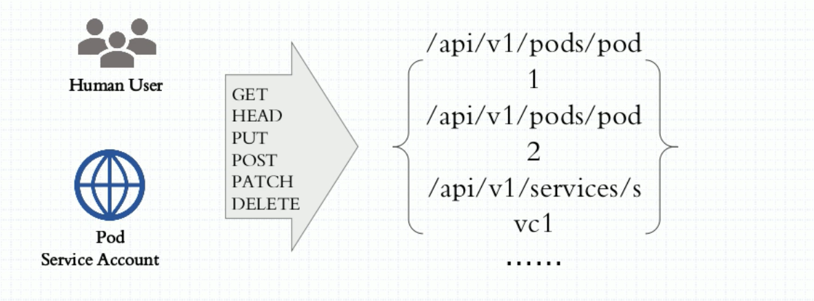
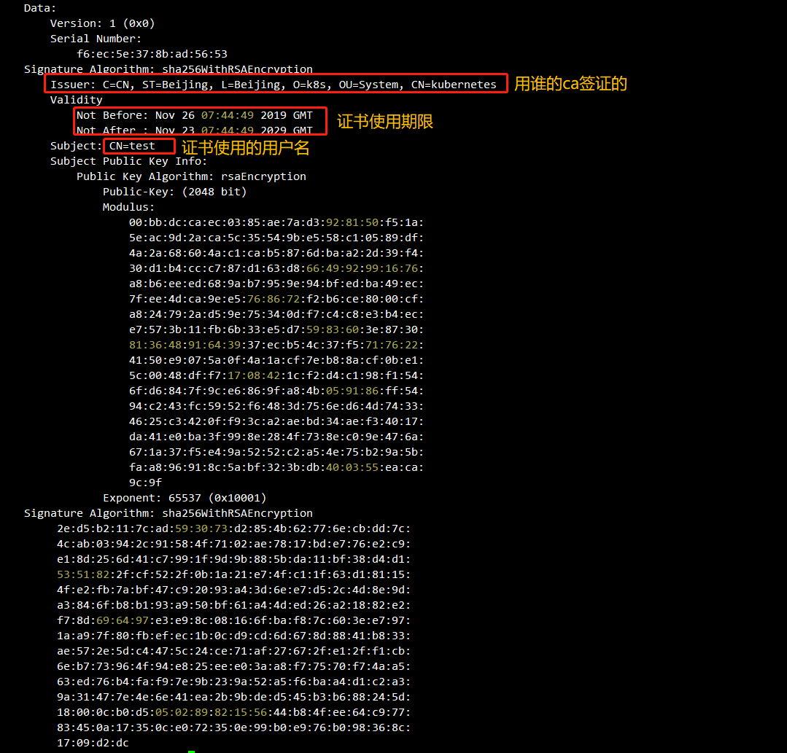

#### 流程: 帐户-->认证-->授权-->准入控制


- kubernetes集群中账户分为两类，Kubernetes管理的serviceaccount(服务账户)和useraccount（用户账户）,当用户访问集群（例如使用kubectl命令）时，apiserver 会将您认证为一个特定的 User Account（目前通常是admin，除非您的系统管理员自定义了集群配置）。Pod 容器中的进程也可以与 apiserver 联系。 当它们在联系 apiserver 的时候，它们会被认证为一个特定的 Service Account。在这两大类帐户处理请求的过程中，Kubernetes使⽤⾝份验证插件对API请求进⾏⾝份验证，⽀持的认证⽅式包括客户端证书、承载令牌（bearer tokens）、⾝份验证代理（authenticating proxy）或HTTP basic认证等。认证插件负责鉴定⽤户⾝份，授权插件⽤于操作权限许可鉴别，⽽准⼊控制则⽤于在资源对象的创建、删除、更新或连接（proxy）操作时实现更精细的许可检查。




**1. User Account帐户 --> tls证书认证**
   - User account是跨namespace的，而service account则是仅局限它所在的namespace；
   - 创建用户和证书
```shell

# kubectl proxy  --port=8080     # 用8080代理访问网关
openssl genrsa -out test.key 2048   # 创建私钥
openssl req -new -key test.key -out test.csr -subj "/CN=test"   # 基于test.key生成证书,cn为用户帐号名字
openssl x509 -req -in test.csr -CA /opt/kubernetes/ssl/ca.pem -CAkey /opt/kubernetes/ssl/ca-key.pem -CAcreateserial -out test.crt -days 3650  # 用ca签证,-CAcreateserial用ca自己的认证符号信息
openssl x509 -in test.crt -text -noout
# 用刚刚的证书新增一个访问用户
kubectl config set-credentials test --client-certificate=test.crt --client-key=test.key --embed-certs=true
#  删除刚刚创建的用户
kubectl config unset users.test--client-certificate=test.crt
# 1. 配置访问的集群
kubectl config set-cluster k8s-cluster1 --server=https://192.168.0.130:6443 --certificate-authority=/opt/kubernetes/ssl/ca.pem --embed-certs=true
# 2. 配置访问的用户
kubectl config set-credentials fengzi --client-certificate=test.crt --client-key=test.key --embed-certs=true
# 3. 配置访问集群环境的上下文
kubectl config set-context fengzi --cluster=k8s-cluster1 --user=fengzi --namespace=kube-system
# 4. 使用当前使用的context
kubectl config use-context fengzi
# 5. 创建role
# 6. 创建rolebinding
```

   - 查看配置好的config
```yaml
# kubectl config view --kubeconfig=/opt/kubernetes/cfg/kube_controller_manager.kubeconfig
# 样例详解
apiVersion: v1
clusters:   # 集群列表
- cluster:    # 集群1
    certificate-authority-data: DATA+OMITTED  # 集群认证信息,服务端证书等
    server: http://127.0.0.1:8080   # 集群服务器地址
  name: kubernetes    # 这个集群的名字
# -------------------------------------------------------------------
users:    # 用户列表
- name: system:kube-controller-manager    # 用户1-名字
  user:     # 用户访问集群的客户端证书等
    client-certificate-data: REDACTED   # 证书
    client-key-data: REDACTED   # 私钥
# -------------------------------------------------------------------
contexts:     # 用户和集群关系上下文
- context:    # 上下文1
    cluster: kubernetes   # 要访问哪个集群
    user: system:kube-controller-manager    # 用哪个用户访问这个集群
  name: kubernetes    # context上下文1的名字
# -------------------------------------------------------------------
current-context: kubernetes   # 当前使用的context上下文的名字
kind: Config
preferences: {}


```


##### 2 Service Account 帐户 ---> 令牌（bearer tokens）认证
- 每个namespace都会自动创建一个default service account
- Token controller检测service account的创建，并为它们创建secret
- 如果Pod没有指定ImagePullSecrets，则把service account的ImagePullSecrets加到Pod中每个container启动后都会挂载该service account的token和ca.crt到/var/run/secrets/kubernetes.io/serviceaccount/

- 2.1 绑定 Service Account 帐户
```bash
# serviceaccount 认证
# 创建 serviceaccount
[root@localhost ~]# kubectl create serviceaccount test-admin -o yaml --dry-run
apiVersion: v1
kind: ServiceAccount
metadata:
  name: test-admin    # sa名字

```

```bash
[root@localhost ~]# kubectl describe sa test-admin
Name:                test-admin
Namespace:           default
Labels:              <none>
Annotations:         <none>
Image pull secrets:  <none> # 从Docker registry中pull 镜像有关
Mountable secrets:   test-admin-token-k9kx9
Tokens:              test-admin-token-k9kx9    # 认证token,由api自动生成
Events:              <none>
```
```bash
[root@localhost ~]# kubectl describe secret test-admin-token-k9kx9
Name:         test-admin-token-k9kx9
Namespace:    default
Labels:       <none>
Annotations:  kubernetes.io/service-account.name: test-admin  # 看到tocen里有sa的帐户
              kubernetes.io/service-account.uid: c52e7300-8184-4827-8e05-7c24ea7e94e1
Type:  kubernetes.io/service-account-token
Data
====
namespace:  7 bytes
token:      eyJhbGciOiJSUzI1NiIsImtpZCI6IiJ9.eyJpc3MiOiJrdWJlcm5ldGVzL3NlcnZpY2VhY2
ca.crt:     1359 bytes

```
- 2.2 绑定 Service Account 帐户
```yaml
apiVersion: apps/v1
kind: Deployment
metadata: 
  name: nginx-alpine-html
spec:
  replicas: 4
  selector: 
    matchLabels:
      app: nginx-alpine-html
      release: canary
  template:
    metadata:
      labels:
        app: nginx-alpine-html
        release: canary
    spec:
      containers:
      - name: nginx-alpine-html
        image: registry.cn-hangzhou.aliyuncs.com/k8s_xzb/nginx-alpine:1.14
        ports:
        - name: httpd
          containerPort: 80
      serviceAccountName: test-admin    # 关联serviceAccount
```