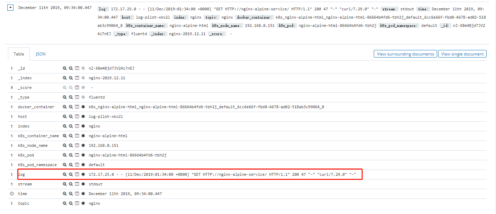
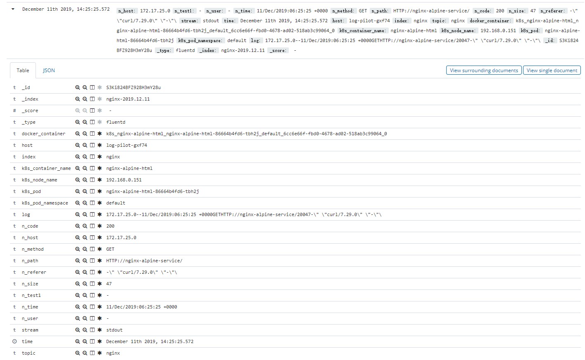

#### 1. k8s日志方案_efk
- 相关网站
   1. k8s提供版本:https://github.com/kubernetes/kubernetes/tree/release-1.15/cluster/addons/fluentd-elasticsearch
   - 阿里云log-pilot项目地址：https://github.com/AliyunContainerService/log-pilot
   - 阿里云官方介绍：https://yq.aliyun.com/articles/674327
   - 阿里云官方搭建：https://yq.aliyun.com/articles/674361?spm=a2c4e.11153940.0.0.21ae21c3mTKwWS

##### 1 fluentd-es-kibana官方安装配置
```bash
for x in es-service.yaml \
es-statefulset.yaml \
fluentd-es-configmap.yaml \
fluentd-es-ds.yaml \
kibana-deployment.yaml \
kibana-service.yaml;
do curl -o $x https://raw.githubusercontent.com/kubernetes/kubernetes/release-1.15/cluster/addons/fluentd-elasticsearch/$x;
done
```
> 修改fluentd的es后端地址,直接apply即可,记得修改镜像地址或科学上网
> 缺点: 要对容器进行分类索引还需修改大量配置

##### 2 阿里云 log-pilot-es-kibana安装配置

- 安装k8s官方仓库中的es和kibana
- 下载阿里云的yaml模板文件
> curl -o https://raw.githubusercontent.com/AliyunContainerService/log-pilot/master/quickstart/kubernetes/log-pilot.yml.tmpl

- 修改模板文件为如下

```yaml
apiVersion: extensions/v1beta1
kind: DaemonSet
metadata:
  name: log-pilot
  labels:
    k8s-app: log-pilot
spec:
  updateStrategy:
    type: RollingUpdate
  template:
    metadata:
      labels:
        k8s-app: log-pilot
    spec:
      tolerations:
      - key: node-role.kubernetes.io/master
        effect: NoSchedule
      containers:
      - name: log-pilot
        image: registry.cn-hangzhou.aliyuncs.com/k8s_xzb/log-pilot:0.9.7-fluentd
        env:
          - name: "LOGGING_OUTPUT"
            value: "elasticsearch"
          - name: "ELASTICSEARCH_HOST"
            value: "elasticsearch-logging.kube-system"  # 修改为自己的es地址
          - name: "ELASTICSEARCH_PORT"
            value: "9200"
          - name: "NODE_NAME"
            valueFrom:
              fieldRef:
                fieldPath: spec.nodeName
        volumeMounts:
        - name: sock
          mountPath: /var/run/docker.sock
        - name: root
          mountPath: /host
          readOnly: true
        - name: pos
          mountPath: /pilot/pos
        - name: localtime
          mountPath: /etc/localtime
        securityContext:
          capabilities:
            add:
            - SYS_ADMIN
      terminationGracePeriodSeconds: 30
      volumes:
      - name: sock
        hostPath:
          path: /var/run/docker.sock
      - name: root
        hostPath:
          path: /
      - name: pos
        emptyDir: {}
      - name: localtime
        hostPath:
          path: /etc/localtime
```
- 启动完es和kibana后直接启动log-pilot

- 配置收集日志的pod,以下为例程

```yaml
      containers:
      - name: nginx-alpine-html
        image: registry.cn-hangzhou.aliyuncs.com/k8s_xzb/nginx-alpine:curl
        ports:
        - name: http
          containerPort: 80
        env:
        - name: aliyun_logs_nginx   # aliyun_logs为前缀 后面的nginx为索引名
          value: "stdout"   # 默认输出格式
        # - name: aliyun_logs_nginx1
        #   value: "/var/log/nginx/*.log"
#        - name: aliyun_logs_nginx_format    # 格式化插件,好像并没有启作用
#          value: "regexp"   # 正则提取,好像并没有启作用
#        - name: aliyun_logs_nginx_format_pattern  # 正则实例,好像并没有启作用
#          value: '/^(?<user1>[^$]*)$/'    # 正则规则,好像并没有启作用
      #   volumeMounts:
      #   - name: nginxlogs
      #     mountPath: /var/log/nginx/
      # volumes:
      # - name: nginxlogs
      #   emptyDir: {}


```
- 启动nginx将自动为nginx pod收集日志如下




- 先看一下log-pilot pod里的流程

```shell
# ps一下发现log-pilot启动了三个进程
/pilot/pilot -template /pilot/fluentd.tpl -base /host -log-level debug  # 根据模板文件自动生成fluentd模板到配置目录
{fluentd} /usr/bin/ruby /usr/bin/fluentd -c /etc/fluentd/fluentd.conf -p /etc/fluentd/plugins --workers 1 # 监控配置文件变化????
/usr/bin/ruby -Eascii-8bit:ascii-8bit /usr/bin/fluentd -c /etc/fluentd/fluentd.conf -p /etc/fluentd/plugins --workers 1 --under-supervisor  # 启动fluentd????

ls -lah /pilot

drwxr-xr-x    3 root     root         104 Dec 11 09:33 .
drwxr-xr-x   21 root     root        4.0K Dec 11 09:33 ..
-rwxr-xr-x    1 root     root        7.2K Apr 23  2019 config.fluentd # 为sh脚本文件,根据参数生成fluentd输出配置文件,对应pilot yaml文件里的 LOGGING_OUTPUT 环境变量
-rwxr-xr-x    1 root     root        1.5K Apr 23  2019 entrypoint
-rw-r--r--    1 root     root        1.1K Apr 23  2019 fluentd.tpl  # fluentd配置模板,将在/etc/fluentd/生成fluentd.conf和根据被采集的pod在/etc/fluentd/conf.d/下生成配置文件
-rwxr-xr-x    1 root     root         113 Apr 23  2019 healthz
-rwxr-xr-x    1 root     root       10.7M Apr 23  2019 pilot
drwxrwxrwx    2 root     root          87 Dec 11 09:33 pos

```
- fluentd.tpl 修改模板内容
> > 主要生成/etc/fluentd/conf.d/容器hash值.conf 配置文件
```ruby
# pilot首先会对采集的日志进行json化并添加两个字段,stream和time
# Fluentd有7种插件：Input、Parser、Filter、Output、Formatter、Storage和Buffer
# fluentd的流程为 Input-->Filter-->Output
# https://www.fluentd.org/plugins/all  插件网址
# https://docs.fluentd.org  官方文档
{{range .configList}}
<source>    # Input段,输入源
  @type tail  # @开头的为内置插件  使用tail插件进行日志输入
  tag docker.{{ $.containerId }}.{{ .Name }}  # 给日志打tag,其它段根据些tag作对应处理
  path {{ .HostDir }}/{{ .File }} # 容器日志路径

  <parse>   # 自定义插件段
  {{if .Stdout}}  # 如果stdout为真则使用json插件?????
  @type json    # 对tail 输入的日志用json解析成不同的k/v字段
  {{else}}
  @type {{ .Format }}   # 没有则使用自定义的插件?在pod中怎么定义?
  {{end}}


  {{ $time_key := "" }}   # 指定时间字段?????
  {{if .FormatConfig}}
  {{range $key, $value := .FormatConfig}}   #格式化时间字段
  {{ $key }} {{ $value }}
  {{end}}
  {{end}}   # 两个end???


  {{ if .EstimateTime }}
  estimate_current_event true
  {{end}}
  keep_time_key true    # 保留时间字段


  </parse>

  read_from_head true   # 日志从头部开始读取
  pos_file /pilot/pos/{{ $.containerId }}.{{ .Name }}.pos     #记录上一次读取的位置
</source>


<filter docker.{{ $.containerId }}.{{ .Name }}>   # 过滤器,对应输入源中的tag
  @type record_transformer    # 使用record_transformer 插件
  enable_ruby true    # 开启ruby语法,可使用ruby代码
  <record>    # 添加新的字段
    host "#{Socket.gethostname}"    # 添加host字段,Socket.gethostname应该为容器里的变量
    {{range $key, $value := .Tags}}   # 添加tags字段???
    {{ $key }} {{ $value }}
    {{end}}

    {{if eq $.output "elasticsearch"}}    # 判断输出源
    _target {{if .Target}}{{.Target}}-${time.strftime('%Y.%m.%d')}{{else}}{{ .Name }}-${time.strftime('%Y.%m.%d')}{{end}}
    {{else}}
    _target {{if .Target}}{{.Target}}{{else}}{{ .Name }}{{end}}
    {{end}}

    {{range $key, $value := $.container}}   # 添加容器相关字段????
    {{ $key }} {{ $value }}
    {{end}}
  </record>
</filter>
{{end}}

```
- config.fluentd 内容和作用
> 主要生成/etc/fluentd/fluentd.conf 主配置文件

```ruby
# 此配置文件为yaml中字义了输出对象为es的配置文件
@include conf.d/*.conf
<match docker.**>     # match 就是通过 tag 匹配输入源的日志指定输出到哪里存储
        # *：匹配任意一个 tag；
        # **：匹配任意数量个 tag；
        # a b：匹配 a 或 b；
        # {X,Y,Z}：匹配 X, Y, Z 中的一个。
        # match 是从上往下依次匹配的，一旦一个日志流被匹配上，就不会再继续匹配剩下的 match 了。 所以如果有 <match **> 这样的全匹配，一定要放到配置文件的最后
@type elasticsearch   # 使用es插件
hosts elasticsearch-logging.kube-system:9200
reconnect_on_error true

target_index_key _target
type_name fluentd # 指定type字段值
</match>
<system>

</system>
```

- 默认收集的日志是整条的.我们需要将这日志再次进行分字段显示以供统计

> 修改fluentd.tpl 模板文件---(现在是写死了配置,以后需要根据容器调配不同的处理条件)

```ruby
# 修改此段内容
{{range .configList}}
<source>
  @type tail
  tag docker.{{ $.containerId }}.{{ .Name }}
  path {{ .HostDir }}/{{ .File }}
  <parse>
  {{if .Stdout}}
  @type regexp  # 修改这段为regexp正则插件
  # 增加下面这段,增加正则规则,正则以/开头和结尾包起来
  # 正则调试网址:  http://fluentular.herokuapp.com
  # 由于log-pilot采集的日志自动json化了,所以网上的正则不通用,需自行更改,暂不知如何不json化
  # 此正则不严谨且只适合默认nginx,需修改
  expression /^\{\"log\"\:\"(?<n_host>[^ )]*) (?<n_test1>[^ ]*) (?<n_user>[^ ]*) \[(?<n_time>[^\]]*)\] \\"(?<n_method>\S+)(?: +(?<n_path>[^\"]*?)(?: +\S*)?)?" (?<n_code>[^ ]*) (?<n_size>[^ ]*) \\"(?<n_referer>[^$]*)n","stream":"(?<stream>[^$]*)","time":"(?<time>[^$]*)"}/
  time_format %Y-%m-%dT%H:%M:%S.%NZ
  keep_time_key true
  </parse>

  read_from_head true
  pos_file /pilot/pos/{{ $.containerId }}.{{ .Name }}.pos
</source>


<filter docker.{{ $.containerId }}.{{ .Name }}>
  @type record_transformer
  enable_ruby true
  <record>
    # 里面其它的内容不要删除,这里只复制了基本的作说明
    # 拼接起来组成log字段
    log ${record["n_host"] + record["n_test1"] + record["n_user"] + record["n_time"] + record["n_method"] + record["n_path"]+ record["n_code"] + record["n_size"] + record["n_referer"]}
  </record>
</filter>
```
- 重新build为新的log-pilot镜像或yaml挂载
```dockerfile
FROM registry.cn-hangzhou.aliyuncs.com/acs/log-pilot:0.9.7-fluentd
RUN sed -i 's/dl-cdn.alpinelinux.org/mirrors.aliyun.com/' /etc/apk/repositories \
&& apk add --no-cache --update --virtual .build-deps build-base ruby-dev \
&& apk add --update ruby-bigdecimal \
&& gem install fluent-plugin-detect-exceptions fluent-plugin-parser --no-ri --no-rdoc \
&& gem sources --clear-all \
&& apk del .build-deps \
&& rm -rf /home/fluent/.gem/ruby/2.5.0/cache/*.gem
COPY fluentd.tpl /pilot/fluentd.tpl
```

- 查看分割的nginx字段如下



```json
# 采集的日志格式
{"log":"172.17.25.0 - - [11/Dec/2019:01:33:54 +0000] \"GET HTTP://nginx-alpine-service/ HTTP/1.1\" 200 47 \"-\" \"curl/7.29.0\" \"-\"\n","stream":"stdout","time":"2019-12-19T01:33:54.359830283Z"}
```

- 需解决的问题
  
   2. 如何根据不同的pod自动分配不同的配置文件
   3. java错误日志的多行合并
   4. 同步时间
   5. master 连通集群IP
   6. master 安装tab显示

/^(?<remote>[^ ]*) (?<host>[^ ]*) (?<user>[^ ]*) \[(?<time>[^\]]*)\] "(?<method>\S+)(?: +(?<path>[^\"]*?)(?: +\S*)?)?" (?<code>[^ ]*) (?<size>[^ ]*)(?: "(?<referer>[^\"]*)" "(?<agent>[^\"]*)"(?:\s+(?<http_x_forwarded_for>[^ ]+))?)?$/


cat >> $FLUENTD_CONFIG << EOF
<match docker.**>
@type elasticsearch
hosts $ELASTICSEARCH_HOSTS
reconnect_on_error true
${ELASTICSEARCH_USER:+user ${ELASTICSEARCH_USER}}
${ELASTICSEARCH_PASSWORD:+password ${ELASTICSEARCH_PASSWORD}}
${ELASTICSEARCH_PATH:+path ${ELASTICSEARCH_PATH}}
${ELASTICSEARCH_SCHEME:+scheme ${ELASTICSEARCH_SCHEME}}
${ELASTICSEARCH_SSL_VERIFY:+ssl_verify ${ELASTICSEARCH_SSL_VERIFY}}
target_index_key _target
type_name fluentd
$(bufferd_output)
</match>
EOF
}


^(?<time>\d{4}-\d{1,2}-\d{1,2} \d{1,2}:\d{1,2}:\d{1,2}\.\d{3}\+\d{4}) \[id\=(?<itd>\d{2})\]\s*(?<level>[^\s]+)\s*(?<log>[^*]*)\d{4}-\d{1,2}-\d{1,2}


^(?<ttime>\d{4}-\d{1,2}-\d{1,2} \d{1,2}:\d{1,2}:\d{1,2}\.\d{3}\+\d{4}) \[id\=(?<itd>\d{2})\]\s*(?<level>[^\s]+)\s*(?<log>.*)


        {{if eq .Tags.log_type "java"}}
      <filter **>
          @type parser
          key_name log
          time_parse no
          format multiline
          format_firstline /\d{4}-\d{1,2}-\d{1,2}/
          format1 ^(?<ttime>\d{4}-\d{1,2}-\d{1,2} \d{1,2}:\d{1,2}:\d{1,2}\.\d{3}\+\d{4}) \[id\=(?<itd>\d{2})\]\s*(?<level>[^\s]+)\s*(?<log>.*)
      </filter>
        {{end}}